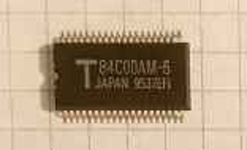
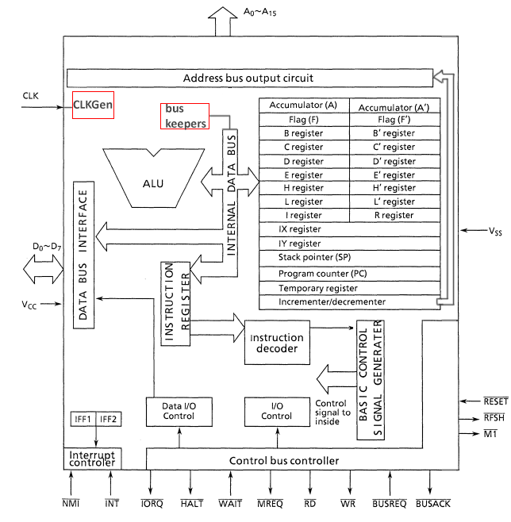

# T84C00

Toshiba Z80 MPU CMOS version.

This research initially aims to examine the design of the custom ALU and Regblock logic at the top of the processor. The rest is not very interesting and is simply "decompiled" into a netlist using Deroute.

:warning: Следует всегда помнить, что разрабочики Z80 были "адептами нетрадиционной полярности" (active-low), в связи с этим схемы чипа переполнены запутанностями, связанными с полярностями сигнала, что взорвало ни один пукан (и ещё бомбанёт).

:warning: One should always remember that Z80 developers were "adepts of non-traditional polarity" (active-low), due to this the chip's circuits are full of confusions related to signal polarities, which blew up a lot of ass (and still will).

Datasets:
- https://siliconpr0n.org/map/toshiba/t84c00am-8-crop/marmontel_mz_gf50x-1.25/  (m1 by onidev)
- https://drive.google.com/drive/folders/1JufzBJ4V05Jy3nRASpeoE-OqmpvBYRzj (Acid delayer by org)

Reference:
- http://www.bitsavers.org/components/toshiba/_dataBook/1990_Toshiba_8-Bit_Microprocessor_TLCS-Z80_85.pdf
