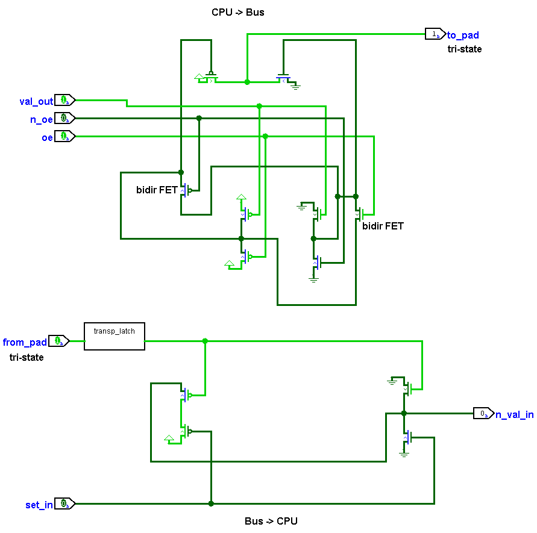

# External Databus I/F

## External Databus Pad

К сожалению, Logisim не поддерживает bidir транзисторы, поэтому работа вЫходной схемы (CPU -> Bus) показана для варианта, когда транизисторы работают в нужную сторону.

Выходная схема представляет собой по сути Bufif1 с комплементарным входом управления (oe + /oe).

Входная схема (Bus -> CPU) это обычный nor, но с небольшой поправкой что один вход nor-a приходит из tri-state входного пада, поэтому может "плавать" и хранится на затворе FET. Для имитации достаточно тыкнуть transparent latch.

Сигнал `set_in`=1 устанавливает вход n_val_in в 0 (то есть по сути в 1, т.к. вход в инверсной логике). Опять грёбаная инверсная-инверсная логика, будьте внимательны.

## Databus I/F

|Сигнал|Откуда/Куда|Описание|
|---|---|---|
|val_out|на пад|Выход на пад |
|n_oe|на пад|Комплемент oe |
|oe|на пад|1: Output enable. Задрайвить пад внешней шины данных|
|n_val_in|с пада|Вход с пада (active low) |
|set_in|на пад|Сделать n_val_in = 0 (входное значение = 1)|
|n_out_enable|с логики управления DataBus|Из этого сигнала получается 2 комплементных oe+/oe|
|n_db_to_latch|с логики управления DataBus| Внутренняя Databus -> Data Latch|
|latch_to_db|с логики управления DataBus| Data Latch -> Внутренняя Databus |
|pad_to_latch|с логики управления DataBus| Pad -> Data Latch;  Если неактивны все сигналы x -> y, то DataLatch заколцовывается сам на себя (FF) |
|db| |Внутренняя шина данных |
