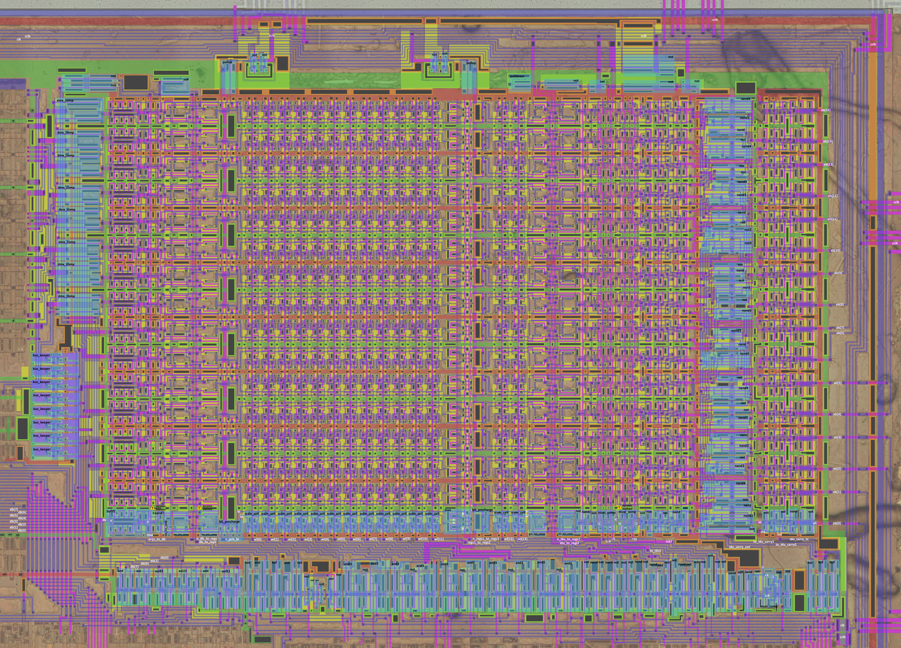
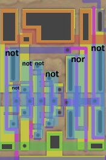
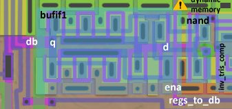
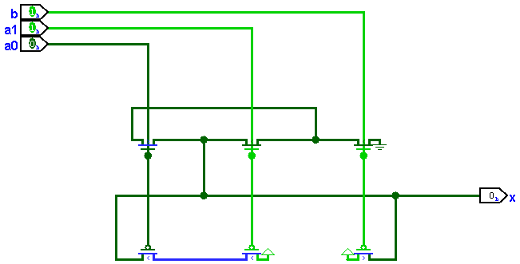

# regblock

## Сигналы

TBD.

## Верхняя вспомогательная логика (Top Aux Logic)

## Нестандартные ячейки для обслуживания регблока (Cells)

В состав входит нецифровая ячейка, которая растягивает нижний уровень входного CLK и инвертирует фронт:

## Databus Keepers

Левее regblock находятся канонические [бас киперы](https://en.wikipedia.org/wiki/Bus-holder) для шины данных.

## Демультиплексор для Старшего значения регистров для DB/ALU (HI Part Demux to ALU)

Используется чтобы выбрать направление куда выдавать значение со старшей части регистров: На АЛУ или на шину данных.

## Databus IO

Выход с регистров на шину данных, уже декомплементированный в 1 провод. Младшая половина регистров сразу соединяется с шиной данных. Старшая половина соединяется через демультиплексор.

Содержит довольно странный Bufif1:

|d|ena|q|
|---|---|---|
|0|0|0 -- тут странно (TBD: разобраться в чём дело) |
|1|0|z|
|0|1|0|
|1|1|1|

Мостик между Databus IO и регистрами1 (Databus IO <-> Regs1 Bridge):

## Regs1 SRAM Array

Договоримся нумеровать регистры от 0 до N слева направо, когда будет известно больше будет добавлена табличка для сопоставления номера регистра и его привычного названия (A, B, C итд.)

Мостик между регистрами1 и регистрами2 (Regs1 <-> Regs2 Bridge):

## Regs2 SRAM Array

Кроме основного блока регистров также имеется маленький "блочок" из двух регистров.
Текущая гипотеза (по аналогии с NMOS) - это регистры IR и PC. Какой из них I+R, а какой PC - пока не понятно.

Мостик между регистрами2 и IDU (Regs2 <-> IDU Bridge):

## Increment/Decrement Unit (IDU)

В процессоре Z80 АЛУ не занимается операцией инкремента/декремента, вместо этого в регблоке присутствует данная схема, как раз для операции +1/-1 над регистрами.
Удобство заключается также в том, что значение с IDU можно сразу выдать на шину адреса (например, для PC).

## IDU Carry Lookahead

Для оптимизации переноса - его вычисление производится "параллельно" со значениями разрядов (снаружи). Для этого используется данная Lookahead логика.

## Addressbus Latch

Хранит результат работы IDU, т.е. непосредственно значение для внешней шины адреса (ab\[15:0\]), которое уходит сразу на пады.

Содержит такой OAI:

