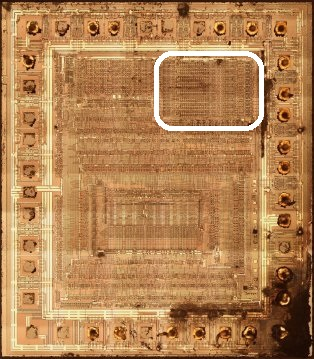
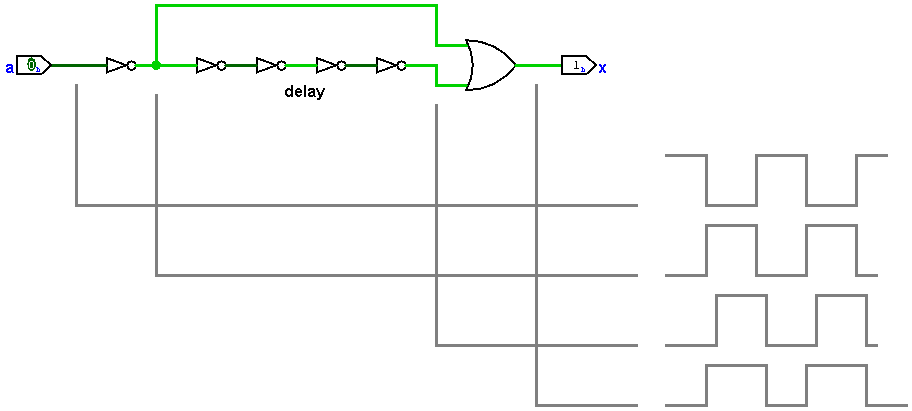
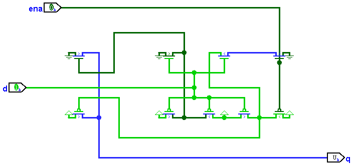
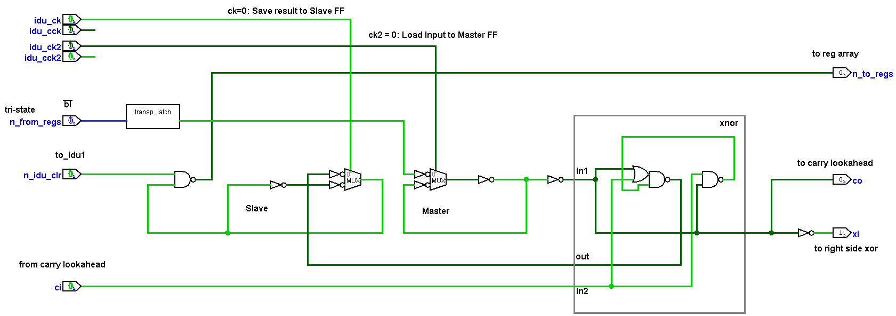

# Regblock

The official designation of this module is `Register Array`. But we will use the more common term regblock.

(the mask shows the regblock and surrounding circuit elements - bus keepers, regblock control cells)

## Signals

|Signal|From/Where to|Description|
|---|---|---|
|clk|ClkGen, all over the chip | TBD. Used in upper auxiliary logic, in regblock control cells |
|cclk|ClkGen, all over the chip |The clk complement. Used in cells for regblock control |
|db \[7:0\]| |Internal data bus|
|ab \[15:0\]| |Address bus for pads |
|regs_to_db|From Regs Control |Regs1 -> Databus |
|db_to_regs|From Regs Control |Databus -> Regs1 |
|n_db_to_regs|From Regs Control |Complement for db_to_regs|
|n_pch_bl|From Regs Control |0: Bit Line precharge for Regs1/Regs2. Precharge bitline wires before actualizing their value|
|wl \[13:0\]|From Regs Control |Word Line enable for a register with the appropriate index|
|regs1_to_regs2|From Regs Control |Regs1 <-> Regs2. The “everyone's favorite” `tran` element (bidirectional connection element of two buses) is used for the connection|
|n_regs1_to_regs2|From Regs Control |Complement for regs1_to_regs2|
|idu_to_regs2|From Regs Control |IDU -> Regs2|
|n_idu_to_regs2|From Regs Control |Complement for idu_to_regs2|
|idu_ck| |ck=0: Save the result of the operation on the IDU in Slave FF|
|idu_cck| |Complement for ck|
|idu_ck2| |ck2=0: Load the input value into the IDU Master FF from the registers|
|idu_cck2| |Complement for ck2|
|n_idu_clr| |0: Set the IDU output to 0 regardless of the calculation results (Note: the IDU output is in inverse logic and this control signal is also in inverse logic, fucking unformals. That is, when this n_idu_clr=0 - the output is 1 (inverse of 0). Be careful)|
|idu_carry_out| |still have no idea|
|to_idu_carry1| |still have no idea|
|to_idu_carry2| |still have no idea|
|idu_carry_in| |still have no idea|
|ci \[15:0\]|IDU FF -> CLA |Internal signal. Output of the input IDU FF value to the CLA |
|co \[15:0\]|CLA -> IDU FF |Internal signal. CLA calculation result for IDU_FF XNOR |
|xi \[15:0\]|IDU FF -> IDU XOR|Internal signal. Output of the input IDU FF value to the right XOR|
|xo \[15:0\]|IDU XOR -> CLA |Internal signal. Output from the right XOR in the CLA|

## Top Aux Logic

This part is mainly responsible for dynamic logic (precharging bit lanes for example), and also sets timings and limits of interconnects between all pieces of the regblock.

Features from left to right in topological order:
- 2 not + not: TBD
- There are 2 pullups in the middle, which open when clk = 0. At this time the bit lanes for Regs1 and Regs2 are precharged, so they cannot be used at this time
- pulldown: TBD
- not+not: TBD
- not, not+not: TBD

## Non-standard cells for regblock operation

A non-digital cell is included that stretches the low level of the input CLK and inverts the edge (used to generate the `n_pch_bl` signal):

We won't study these cells for controlling the regblock yet, because they receive a lot of unknown inputs, most likely from a decoder or sequencer.
The idea was to learn the ports of the regblock by studying these cells (from outside to inside), but it turned out that the ports of the regblock have been studied from inside to outside and there is no need for cells yet.

Separately, I'd like to note that there are a few CondLogic cells on the left side of the row (some aoi + data bus inputs), which is also behind the research domain for now.

## Databus Keepers

To the left of regblock are canonical [bus keepers](https://en.wikipedia.org/wiki/Bus-holder) for the data bus. They also got into regblock by accident, they do not directly relate to it. The developers just decided to stick them where they belonged.

## Demultiplexer for High Register Value for DB/ALU (HI Part Demux to ALU)

It is used to select the direction where to output the value from the high part of the registers: to the ALU or to the data bus. It also has no special relation to the reglock, because the direction selection is done from the ALU part.

## Databus IO

Output from the registers to the data bus, already decoupled into 1 wire. The lower half of the registers is connected directly to the data bus. The higher half is connected via demultiplexer. But for consideration of the regblock we can consider that the data just “goes out somewhere”.

:warning: The nand has dynamic memory on the gate (DLatch), since its input can float since it is the output of a tristate (just add transparent latch on the input to simulate it)

Contains the rather odd Bufif1:

|d|ena|q|
|---|---|---|
|0|0|0 -- it's weird here (TBD: figure out what's wrong) |
|1|0|z|
|0|1|0|
|1|1|1|

Bridge between Databus IO and registers1 (Databus IO <-> Regs1 Bridge):

:warning: The right tristate has dynamic memory on the gate (DLatch) because its input is the output of the left tristate, which can “fall off” and make the input of the right tristate “float”.

## Regs1 SRAM Array

The register cells are typical 6T-Sram Cells with complementary InOut bitline (`bl` + `bl_bar`). Instead of using Sense Amp, an old-school bitline precharge technique is used.

Let's agree to number the registers from 0 to N from left to right, when more will be known a table will be added to compare the register number and its usual name (A, B, C, etc.).

Bridge between registers1 and registers2 (Regs1 <-> Regs2 Bridge):

## Regs2 SRAM Array

In addition to the main register block, there is also a smaller block of two registers.
The current hypothesis (similar to NMOS) is that these are IR and PC registers. Which one is I+R and which one is PC is not clear yet.

Bridge between Regs2 and IDU (Regs2 <-> IDU Bridge):

## Increment/Decrement Unit (IDU) Flip/Flop

In the Z80 processor, the ALU does not handle the increment/decrement operation, instead the regblock contains this circuitry, just for the +1/-1 operation on registers.
It is also convenient that the value from the IDU can be directly output to the address bus (e.g. for PC).

:warning: The right mux has dynamic memory on the gate (DLatch), since its input can float (just add transparent latch on the input to simulate it)

The main part of the IDU includes:
- Master FF for loading the value from the registers
- Slave FF for storing the result of the operation on the IDU and outputting the value back to the registers
- Counting element (XNOR)

## IDU Carry Lookahead

To optimize the carry - its calculation is done “in parallel” with the bit values (outside). This Lookahead logic is used for this purpose.

## IDU XOR + Address SuperInv

Contains a counting element (XOR) as well as a superinverter to output a value for the external address bus (ab\[15:0\]), which goes directly to the pads.

XOR contains such an OAI:

