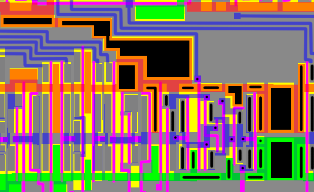
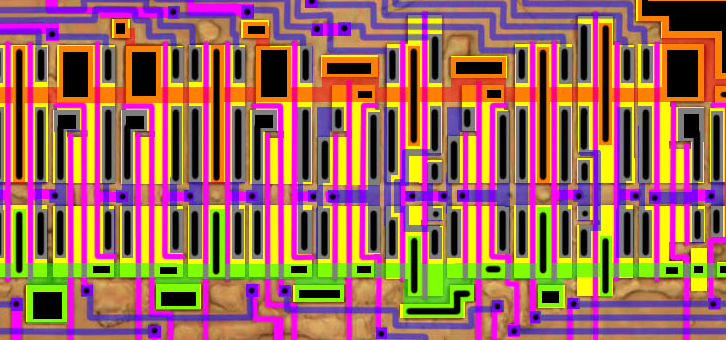

# Notes on topology

In this section, a collection of notable topology features of the chip under study.

## CMOS Pockets

P-pockets for N-type.

## Vias

I guess they haven't learned how to fill with a hole punch yet. They fill with solid polygons.

## Non-standard cells

At first glance it seems that the rows are made up of standard cells. But in fact they are "non-standard" and are also a custom design:

## Deactivated gates

It is not known what technology is used to deactivate the gates, presumably just thickening the sub-gate dielectric.

There are 2 gates shown in the picture. The places where the deactivated gates are located are marked with orange-reddish color.

In general, you can guess where the gates are missing, because the developers made a special way of diffusion in such places (in the form of holes or cutouts).

Either P-transistors or N-transistors are deactivated. And this method is used not only in non-standard cells, but also in blocks with custom design (for example, in the decoder the whole lower P-part is made in this way).
